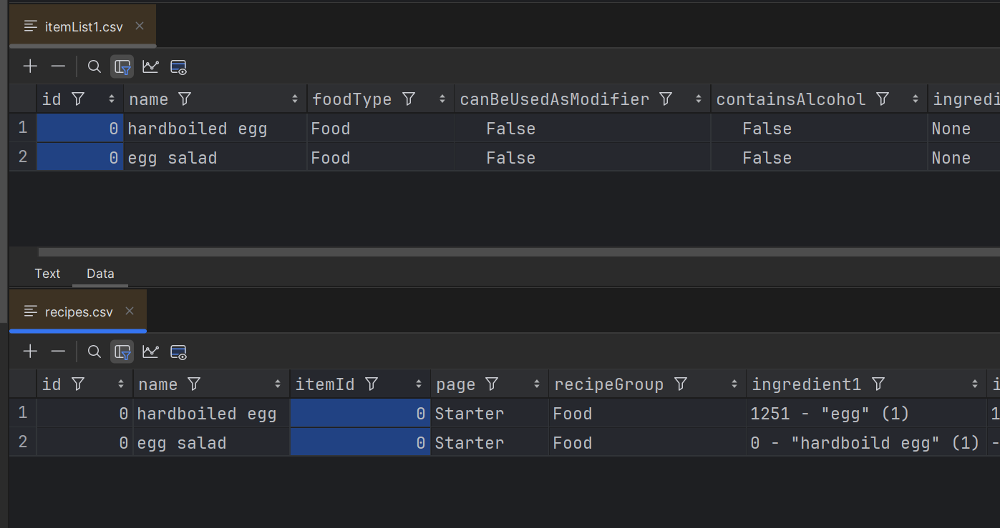
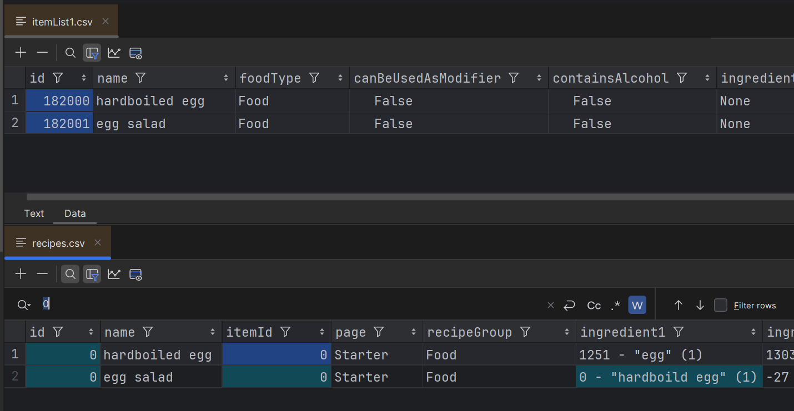
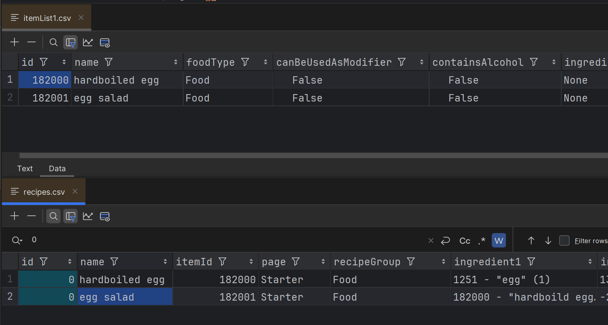

# if you want to not worry about picking ids or having items overlap

Create your Item and Recipe files with 0 as the ids

### Open the game and the mod will assign Ids to all items with id=0
### close the game and review the item/recipe files

The mod cannot change the ingredient/itemIds that are 0 so you need to do that part (open to someone adding a PR with logic thought <3)

After adding itemIds it should look something like so:

### Open the game and the mod will assign Ids to all recipes with id=0

the recipe/item files should now be valid and ready (and they should be loaded into the game already)

