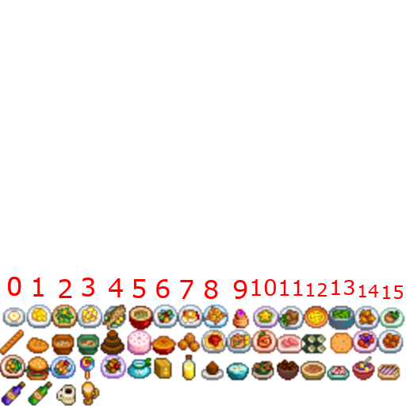
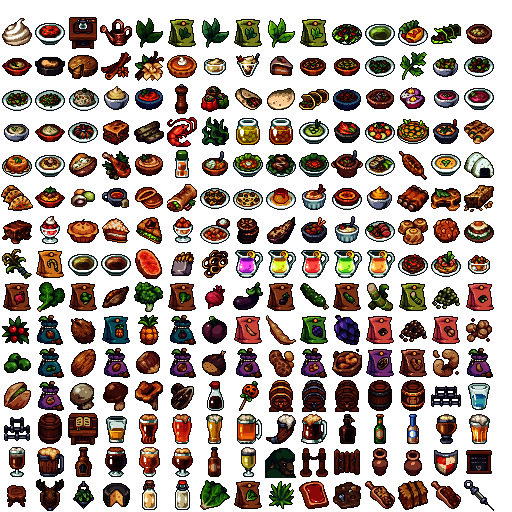
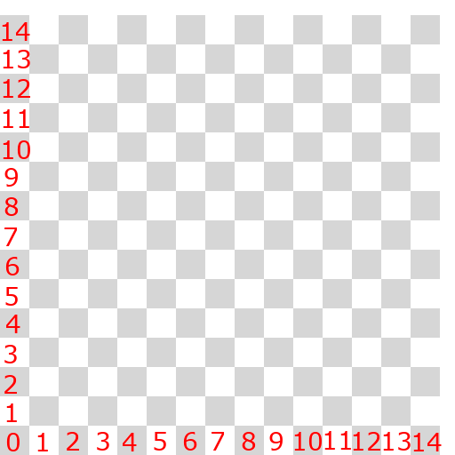

# Create Custom Item

This mod uses 3 file types

- [A spritesheet (.png) file](#spritesheet-file-info) to provide images
- [An item (.csv) file](#item-file-info) to provide item information
- [A recipe (.csv) file](#recipe-file-info) to provide recipe information


- All of these files are expected to be in the BepInEx/plugins folder.
  - the files can be organized into sub folders as well so:
    - ```
      BepInEx/
        plugins/
            myAwesomeModPack/
                sprites/
                    spritesheet1.png
                    spritesheet2.png
                    spritesheet3.png
                items/
                    foodItems.csv
                    toolItems.csv
                    decorItems.csv
                recipes/
                    foodRecipes.csv
                    expensiveRecipes.csv
                    cheaperRecipes.csv
    
      ```
  - or any other structure that makes sense to you can be done (if still in the plugins folder)


#### If you are having issues with ID assignment [see here](HaveTheModCreateIds.md)


## Start with images
> For demonstration here are some items from Stardew Valley

- these don't look very good because Stardew using 16x16 sprites and just stretching them to 33x33 isn't the best for quality but these are just for example.
### If anyone wants to provide me with original art I can use it here <3



So here we have 49 sprites we can make items for (I will not do all of them for this example).
 
So lets save this file into BepInEx/plugins/myAwesomeModPack/exampleSpriteSheet.png

Now the sprite sheet is done.

## Create Item .csv
#### Create a csv with following header
> [id](#item-id),[name](#name),[foodType](#foodType),[spriteSheetName](#spriteSheetName),[spriteX](#spriteX),[spriteY](#spriteY),[containsAlcohol](#containsAlcohol),[canBeUsedAsModifier](#canBeUsedAsModifier),[ingredientType](#ingredientType),[modifiers](#modifiers),[sellPrice](#sellPrice),[canBeAged](#canBeAged),[hasToBeAgedMeal](#hasToBeAgedMeal),[appearsInOrders](#appearsInOrders),[excludedFromTrends](#excludedFromTrends)

#### example with explanation to follow
```
id,name,foodType,spriteSheetName,spriteX,spriteY,containsAlcohol,canBeUsedAsModifier,ingredientType,modifiers,sellPrice,canBeAged,hasToBeAgedMeal,appearsInOrders,excludedFromTrends
182000,Sunny Side Up Egg,Food,myAwesomeModPack/exampleSpriteSheet.png,0,3,false,false,None,,1,false,false,false,false
182001,Pizza,Food,myAwesomeModPack/exampleSpriteSheet.png,13,3,false,false,None,,3,false,false,true,false
182002,Coffee,Drink,myAwesomeModPack/exampleSpriteSheet.png,2,0,false,true,None,,2,false,false,false,false
```

- So Sunny Side Up Egg
  - Id=182000
  - is a Food
  - is the image (0,3) in myAwesomeModPack/exampleSpriteSheet.png
  - it **does not** contain alcohol
  - it **cannot** be used as a modifier
  - it has **None (no)** ingredient type
  - it has **no** modifiers
  - it has a sell price of 1 silver
  - it **cannot** be aged
  - it **does not** need to be aged
  - it **cannot** appear in "orders" from the board
  - it **is not** exclude from trends
- So Pizza
  - Id=182001
  - is a Food
  - is the image (13,3) in myAwesomeModPack/exampleSpriteSheet.png
  - it **does not** contain alcohol
  - it **cannot** be used as a modifier
  - it has **None (no)** ingredient type
  - it has **no** modifiers
  - it has a sell price of 3 silver
  - it **cannot** be aged
  - it **does not** need to be aged
  - it **can** appear in "orders" from the board
  - it **is not** exclude from trends
- So Coffee
  - Id=182002
  - is a Drink
  - is the image (2,0) in myAwesomeModPack/exampleSpriteSheet.png
  - it **does not** contain alcohol
  - it **can** be used as a modifier (idea being coffee-infused ***)
  - it has **None (no)** ingredient type
  - it has **no** modifiers
  - it has a sell price of 2 silver
  - it **cannot** be aged
  - it **does not** need to be aged
  - it **cannot** appear in "orders" from the board
  - it **is not** exclude from trends

### [Details](#item-file-info)


## Create Recipes
#### Create a csv with following header
> [id](#recipe-id),[recipeGroup](#recipeGroup),[itemId](#itemId),[name](#name),[ingredient1](#ingredient),[ingredient2](#ingredient),[ingredient3](#ingredient),[ingredient4](#ingredient),[ingredient5](#ingredient),[workstation](#workstation),[page](#page),[fuel](#fuel),[time](#time),[outputAmount](#outputAmount)

#### example with explanation to follow
```
id,recipeGroup,itemId,name,ingredient1,ingredient2,ingredient3,ingredient4,ingredient5,workstation,page,fuel,time,outputAmount
182000,Food,182000,sunny side up egg,1251 - (1),-27 - (1),,,,672,Starter,1,10,10
182001,Food,182001,pizza,1292 - (10),-4 - (1),3010 - (1),,,672,PastaRice,10,20,10
182002,Drink,182002,coffee,999999 - "coffee beans" (2),,,,,672,Drinks,10,20,10
```

- So Sunny Side Up Egg
  - is a Food
  - item this recipe creates is itemId=**182000**
  - it requires **1 of item 1251 AND 1 of any item of group -27**
  - it is crafted in **672 (the oven)**
  - it will show in the **Starter** Page
  - it will cost **1** fuel
  - it will take **10** minutes
  - it will produce **10** items
- So Pizza
  - is a Food
  - item this recipe creates is itemId=**182001**
  - it requires **10 of item 1292 AND 1 of any item of group -4 AND 1 of item 3010**
  - it is crafted in **672 (the oven)**
  - it will show in the **PastaRice** Page
  - it will cost **10** fuel
  - it will take **20** minutes
  - it will produce **10** items
- So Coffee
  - is a Drink
  - item this recipe creates is itemId=**182002**
  - it requires **2 coffee beans**
  - it is crafted in **672 (the oven)**
  - it will show in the **Drinks** Page
  - it will cost **10** fuel
  - it will take **20** minutes
  - it will produce **10** items


### [Details](#recipe-file-info)


## Sprite sheet file info
> A sprite sheet is a picture with the game pictures on it for the game to use.

#### Each sprite sheet could have 225 images in it!
#### it is 15 x 15 images and the mod only needs to reference them as (row,col) 

Example:


> Above shows (0,0) Stool, (1,0) antlers, (2,0) hanging plant, (3,0) cheese wheel, (4,0) milk, (5,0) another milk


This mod is using sprite sheet **exactly 512 pixels by 512 pixels**. Each image in the sheet is **33x33 pixels** for 15 rows and 15 columns. Below shows a 512x512 checkerboard with 33x33 boxes.




## Item file info
> A file with comma separated values (a .csv file) defining the new item


### Item id
- a **UNIQUE** number for this item, note the game uses values up to 99,999 as of Sept 2024 so use bigger numbers
  - I picked to start at 182000 because **R**estless**B**arkeep => 18th letter + 2nd letter => 182 + some zeros to not stop on other peoples toes

### name
- name you want to see in the game (translations in the works)

### foodType
- Values are (Food/Drink/None) so is it food drink or something else

### canBeUsedAsModifier
- can this item be used as an inderdient in another food? (think watermelon is a Fruity ingredient to Cocktails)

### modifiers
- when used as an ingredient what is the modifier it will add: (Fruity/Citrus/Sweet/Vanilla/Caramel/Herbal/Hoppy/Bitter/Juicy/Meaty/Fishy/Starchy/Veggie/Cheesy/Sour/Spicy/Aromatic/Seedy/Aged/Dairy)
  - **THIS IS CURRENT NOT WORKING SO DONT WORRY ABOUT IT**

### ingredientType
- when used as an ingredient what group/type does it belong to: (None/Herb/Fruit/Veg/Hop/Honey/Meat/WhiteFish/Grain/Cheese/Flour/Seed/Wort/Yeast/Sandwich/Beer/Wine/Distillate/Cocktail/Liqueur/Mushroom/Legumes/Nuts/BlueFish/Shellfish/Berries)

### sellPrice
- how mean silver pieces will this sell for

### canBeAged
- can you age for profit increase

### hasToBeAgedMeal
- does it **have to be** aged?

### appearsInOrders
- will it appear in the Orders board

### excludedFromTrends
- should it be excluded from the Tavern's Trends


## Recipe file info
> A file with comma separated values (a .csv file) defining the new recipes


### Recipe id
- a **UNIQUE** number for this recipe
  - NOTE: these examples have the recipe and the items with the same value but it does not matter if they do or do not match.

### recipeGroup
- where this recipe should be grouped: (None/Food/Drink/Wood/Stone/Metal)

### itemId
- the unique id of the item this recipe will create

### outputAmount
- the number of items to have the recipe created

### name
- not really used at the moment

### page
- the page the recipe should show up on: (All/Starter/Vegetables/PastaRice/Meat/Fish/Broth/Dessert/Drinks)

### fuel
- how much fuel is used

### time
- how many minutes to complete (probably best to keep it multiplies of 5 )

### workstation
- id to the workstation/crafter that can use this recipe
  - ```
      670 - Distillery
      672 - Oven
      673 - Malting Machine
      674 - Cheese Factory
      675 - Fermentation Tank
      676 - Mash Barrel
      703 - Sawmill
      704 - Smelting Furnace
      706 - Stone Workshop
      709 - Press
      723 - Cutting Axe
      731 - Stonecutter Work Table
      733 - Mixing Tank
      728 - Blacksmith Table
      1232 - Forage Table
      1240 - Kitchen Table
      1380 - Preserves Table
      1451 - Tackle Table
      1532 - Cocktail Table
    ```


### ingredient
- the recipe defined by its required ingredients.
  - so it is structured "ingredientId - (numberNeeded)"
  - The game limits recipes to be at most 5 ingredients so the mod supports 5 columns for ingredients (creatively named: ingredient1, ingredient2, ingredient3, ingredient4, ingredient5)
    - the IngredientId is the ItemId and the numberNeeded is the amount of those you require.
      - the IngredientId can also be a Group Id to say any item in this Group/Category like -4 cheese
        - ```
            -45 - Beer Group
            -44 - Wine Group
            -43 - Grape Juice
            -42 - Roasted Hops
            -41 - Black Hops
            -40 - Light Hops
            -39 - Roasted Gray Malt
            -38 - Roasted Light Malt
            -37 - Gray Malt
            -36 - Light Malt
            -35 - Mince and Seafood
            -34 - Mince
            -33 - Crab Group
            -32 - Cephalopod
            -31 - Citrus
            -30 - Pickles Group
            -29 - Lemon Lime
            -28 - Cake Flavors
            -27 - Oily
            -23 - Milk Group
            -22 - Ribs Group
            -21 - Fat Group
            -19 - White Fish
            -18 - Fish and Seafood
            -17 - Blue Fish
            -16 - Seafood Group
            -15 - Group Meat Vegetables or Fish
            -14 - Nuts
            -13 - Tea Leaves
            -12 - Legumes Group
            -11 - Meat and Fish Group
            -10 - Mushrooms Group
            -9 - Vegetables Group
            -8 - Fish Group
            -7 - Seeds Group
            -6 - Dishes Group
            -5 - Bread Group
            -4 - Cheese Group
            -3 - Cereal Group
            -2 - Fruit Group
            -1 - Meat Group
           ```
      - To make all of this I added the option to put labels in the recipeIngredients because seeing
        - ```
          1220 - (10),1221 - (1),1223 - (12)
          1220 - (10),1221 - (1),1223 - (12)
          1220 - (10),1221 - (1),1223 - (12)
          1220 - (10),1221 - (1),1223 - (12)
          1220 - (10),1221 - (1),1223 - (12)
          1220 - (10),1221 - (1),1223 - (12)
          1220 - (10),1221 - (1),1223 - (12)
          1220 - (10),1221 - (1),1223 - (12)
          ```
      - ends up feeling like a wall of numbers and I don't remember what numbers mean; so, you can put a **"description"**
        - ```
          1220 - "Chocolate" (10),1221 - "Wild Turkey" (1),1223 - "Christman Carrot" (12)
          1220 - "Chocolate" (10),1221 - "Wild Turkey" (1),1223 - "Christman Carrot" (12)
          1220 - "Chocolate" (10),1221 - "Wild Turkey" (1),1223 - "Christman Carrot" (12)
          1220 - "Chocolate" (10),1221 - "Wild Turkey" (1),1223 - "Christman Carrot" (12)
          1220 - "Chocolate" (10),1221 - "Wild Turkey" (1),1223 - "Christman Carrot" (12)
          1220 - "Chocolate" (10),1221 - "Wild Turkey" (1),1223 - "Christman Carrot" (12)
          1220 - "Chocolate" (10),1221 - "Wild Turkey" (1),1223 - "Christman Carrot" (12)
          1220 - "Chocolate" (10),1221 - "Wild Turkey" (1),1223 - "Christman Carrot" (12)
          ```