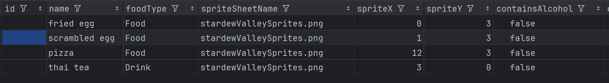
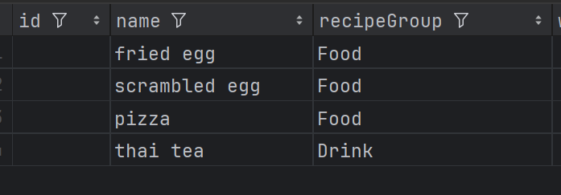
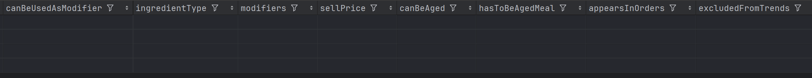
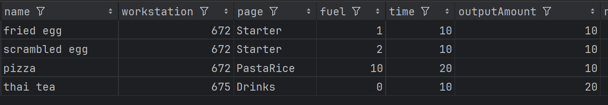
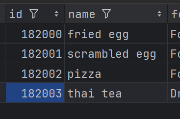
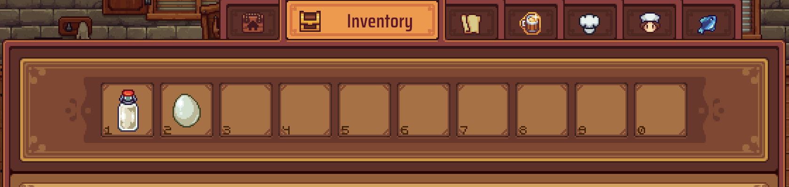
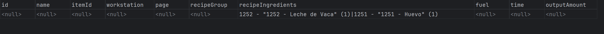
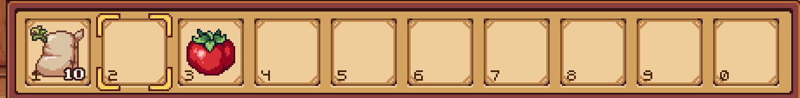
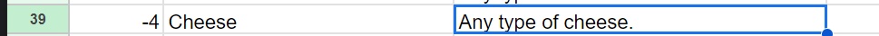
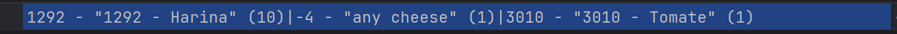

# CustomItems Guide with StardewValley items

Helpful links:
- [base game item ids](https://docs.google.com/spreadsheets/d/1wjlKxpFTVQk4RLaSgUeP1kHNX8cBqmkt/edit?gid=1938423554#gid=1938423554)

## Step 1
#### Get Rough Ideas


```
Food:
fried egg (oil + egg) [0,3]
scrambled egg (milk + egg) [1,3]
pizza (bread + tomato + cheese) [12,3]

Drinks
thai tea (milk + black tea) [3,0] 
```

#### Put in easy fields into an item.csv


#### Put in easy fields into a recipe.csv file



### more complex:


#### Can be used as modifier (true or false)
> So can this item be used to modify another item (barely vs wheat modify the bread being made)

#### ingredient type (Food or Drink or None)
> Is this item Food or Drink or None

#### modifiers (currently does nothing so leave alone)

#### sellPrice
- this is currently whole silver coins.

#### canBeAged (true or false)
> Can this item be aged with aging tools in Cellar

#### has to be aged meal (true or false)
> do you "HAVE TO" age the meal before selling to customers


#### appearsInOrders (true or false)
> can this item appear in orders

#### excludeFromTrends (true or false)
> can this item appear in trends

after filling those in it should look like so in the Items.csv


now to fill in more of the recipes.csv



#### workstation
> Look through the list of workstations in the [readme](readme.md) to assign desired crafters/workstations for the new recipes. Above I used Oven and the Barrel Tank.

#### page
> Look through the list of pages in the [readme](readme.md) to assign desired page to show this recipe on

#### fuel time outputAmount
> this is just balancing however you see fit for the new recipes.


## Assign item Ids to the new items
> Note currently (Sept 2024) the game is using ids up to 99,999 so try to not use ids lower than that here I picked 182 because (RestlessBarkeep => RB => Alphabet Character 18 + Alphabet Character 2 + a bunch of 0s to make distinct)


## Assign item Ids to the Recipes
> Note the recipe id does not need to and might not equal the itemId just happens to here


## harder steps

#### recipeIngredients
- formated as: "itemId - (itemAmount)"
  > you can also do it like this: itemId - "optional item name" (itemAmount)
- looking up ids is a bit of a pain, so I added a debugging tool to this mod, when enabled and the ModKey is pressed all items currently in the toolbar will be pushed into a tempRecipe file
  - this will assume all items in your toolbar are for one recipe so
- NOTE: anything in the "optional item name" will just be ignored by the mod


So I put a milk and egg into my toolbar and hit mod key


testRecipe.csv:
1 cow milk and 1 egg



#### (cheese) pizza:



> have to add in the cheese requirement


> lookup the cheese group 





#### Done!!

