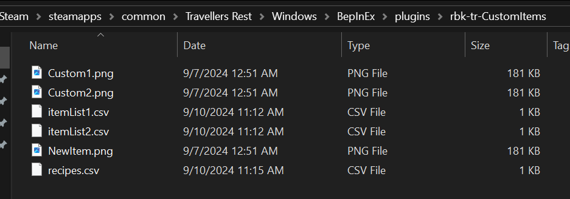

# CustomItems

Mod to allow adding more Items into the game

Only tested Food/Drink and Recipes atm

(currently ToolTips do not work)

# How it works

The mod will look into all folders provided in the config for any .csv file containing item/recipe and will load those csv into memory and on game start will add all into the inGame database. For all Sprites in the item file you will need to provide a .png spriteSheet and the name with folder to the spriteSheet, note the spritesheet counts off starting at bottom left (0,0) and the file has to be 512x512 pixels.

[item list 1](Example/itemList1.csv)
> (Chocolate Cake, Fried Egg, Omelete)

[item list 2](Example/itemList2.csv)
> (omelete, pizza, thai tea, bubble water)

    Examples:
    Chocolate Cake = 1269 - "flour" (5)|202 - "sugar" (2)|1251 - "egg" (1) 
    Fried Egg = 1251 - "egg" (1)
    Omelete = 1251 - "egg" (6)|-23 - "milk group" (1)

## Create an Item file (.csv)
    id,name,foodType,canBeUsedAsModifier,containsAlcohol,ingredientType,modifiers,sellPrice,canBeAged,hasToBeAgedMeal,appearsInOrders,excludedFromTrends,spriteSheetName,spriteX,spriteY
    182002,Fried Egg,Food,false,false,None,None,2,false,false,false,false,NewItem.png,2,0

##### foodType
- Food or Drink or None

##### ingredientType
- If this new item is an ingredient item what type of ingredient is it 

    None
    Herb
    Fruit
    Veg
    Hop
    Honey
    Meat
    WhiteFish
    Grain
    Cheese
    Flour
    Seed
    Wort
    Yeast
    Sandwich
    Beer
    Wine
    Distillate
    Cocktail
    Liqueur
    Mushroom
    Legumes
    Nuts
    BlueFish
    Shellfish
    Berries

##### modifiers (currently not connected)
- If this new item is an ingredient item what type of modifiers does it provide 

    Fruity
    Citrus
    Sweet
    Vanilla
    Caramel
    Herbal
    Hoppy
    Bitter
    Juicy
    Meaty
    Fishy
    Starchy
    Veggie
    Cheesy
    Sour
    Spicy
    Aromatic
    Seedy
    Aged
    Dairy

##### sellPrice
- this is currently whole silver coins.

## Create a Recipe file (.csv)
    id,name,itemId,workstation,page,recipeGroup,recipeIngredients,fuel,time,outputAmount
    182001,Fried Egg,182001,672,Starter,Food,"1251 - (1)",5,10,1

##### workstation
- id for the workstation this recipe will be added to

    670 - Distillery
    672 - Oven
    673 - Malting Machine
    674 - Cheese Factory
    675 - Fermentation Tank
    676 - Mash Barrel
    703 - Sawmill
    704 - Smelting Furnace
    706 - Stone Workshop
    709 - Press
    723 - Cutting Axe
    731 - Stonecutter Work Table
    733 - Mixing Tank
    728 - Blacksmith Table
    1232 - Forage Table
    1240 - Kitchen Table
    1380 - Preserves Table
    1451 - Tackle Table
    1532 - Cocktail Table

##### page
- What page will this recipe show in the crafter/recipe book

    All
    Starter
    Vegetables
    PastaRice
    Meat
    Fish
    Broth
    Dessert
    Drinks

##### recipeGroup
- What group does this recipe best fit in

    None
    Food
    Drink
    Wood
    Stone
    Metal

##### recipeIngredients
- formated as: "itemId - (itemAmount)"
  - so a fried egg is just 1 egg so "1251 - (1)"
- you can have up to 5 ingredients separated by |
- groupIds are also supported (yes they are negative):

    -45 - Beer Group
    -44 - Wine Group
    -43 - Grape Juice
    -42 - Roasted Hops
    -41 - Black Hops
    -40 - Light Hops
    -39 - Roasted Gray Malt
    -38 - Roasted Light Malt
    -37 - Gray Malt
    -36 - Light Malt
    -35 - Mince and Seafood
    -34 - Mince
    -33 - Crab Group
    -32 - Cephalopod
    -31 - Citrus
    -30 - Pickles Group
    -29 - Lemon Lime
    -28 - Cake Flavors
    -27 - Oily
    -23 - Milk Group
    -22 - Ribs Group
    -21 - Fat Group
    -19 - White Fish
    -18 - Fish and Seafood
    -17 - Blue Fish
    -16 - Seafood Group
    -15 - Group Meat Vegetables or Fish
    -14 - Nuts
    -13 - Tea Leaves
    -12 - Legumes Group
    -11 - Meat and Fish Group
    -10 - Mushrooms Group
    -9 - Vegetables Group
    -8 - Fish Group
    -7 - Seeds Group
    -6 - Dishes Group
    -5 - Bread Group
    -4 - Cheese Group
    -3 - Cereal Group
    -2 - Fruit Group
    -1 - Meat Group
 
